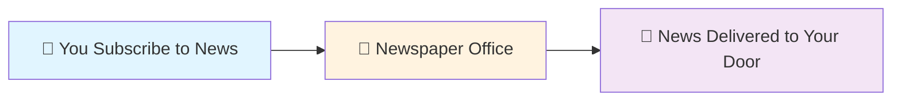
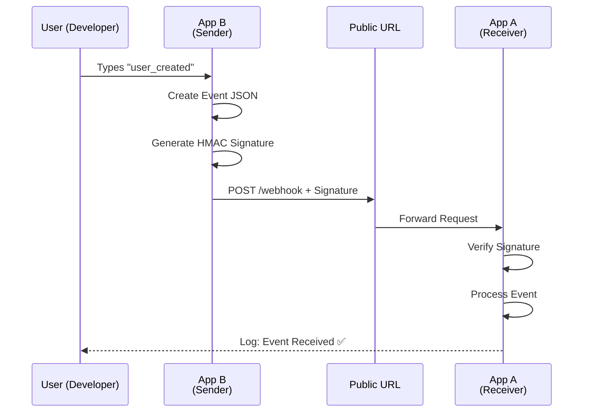
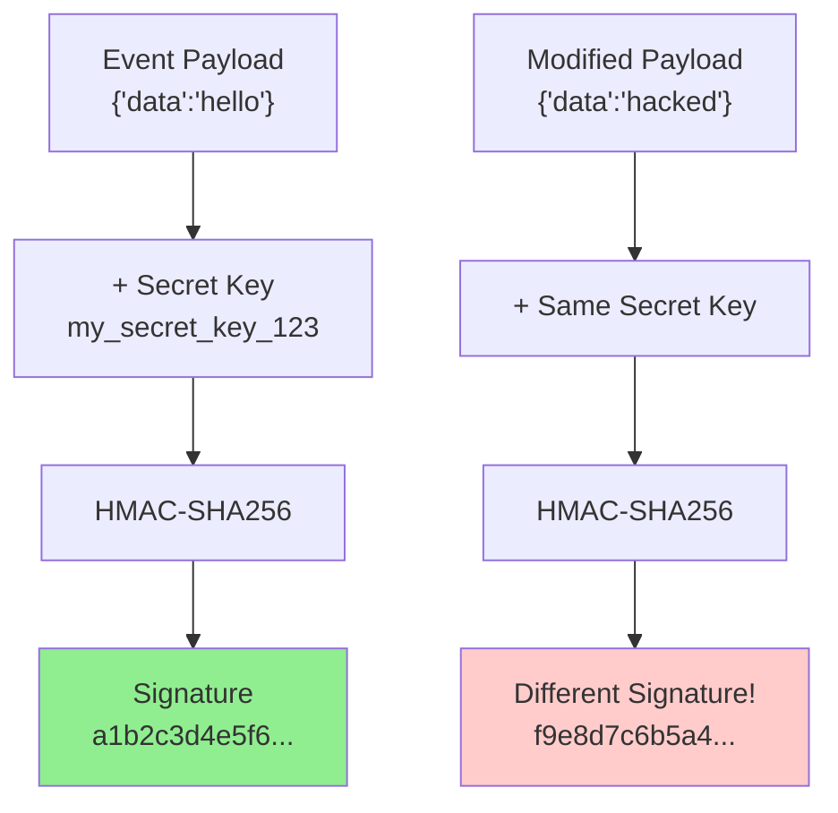
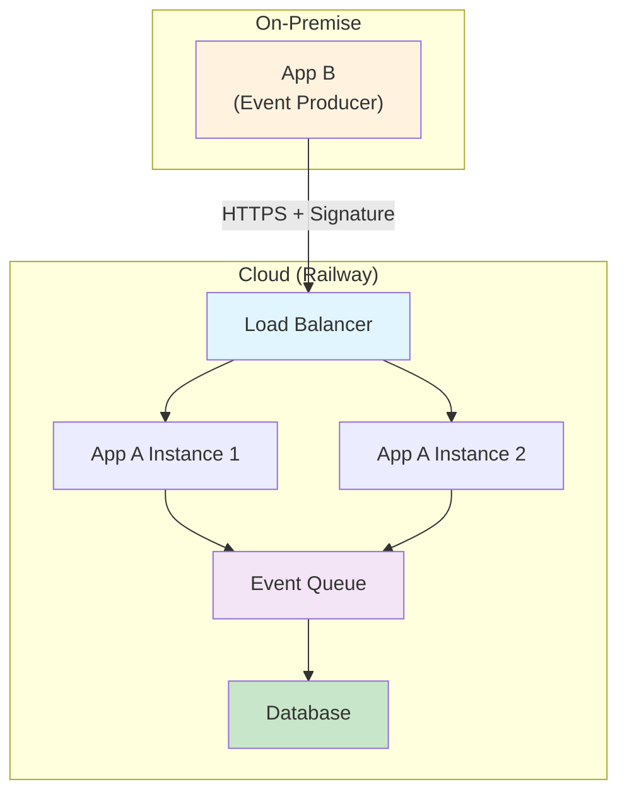
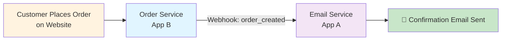
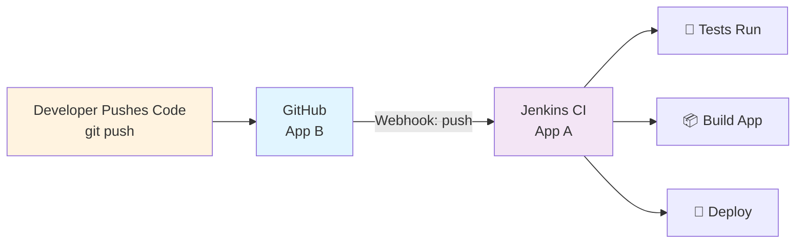
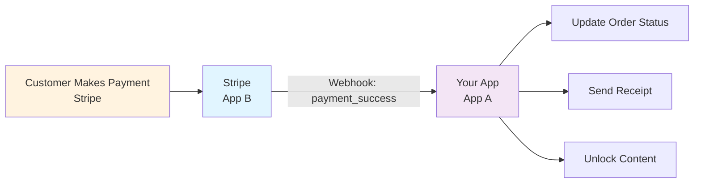

# Secure Webhook Implementation: App-to-App Communication

A production-ready webhook system demonstrating secure inter-application communication using HMAC-SHA256 signature verification. This project teaches how real-world systems like GitHub, Stripe, and AWS communicate securely.


---

## 📖 Table of Contents

- [Overview](#overview)
- [For Beginners](#for-beginners)
- [For Intermediate Developers](#for-intermediate-developers)
- [For Enterprise](#for-enterprise)
- [Real-World Scenarios](#real-world-scenarios)
- [Quick Start](#quick-start)
- [Project Structure](#project-structure)
- [Security](#security)
- [Deployment](#deployment)

---

## Overview

This project demonstrates how **two independent applications communicate securely** in real-time using webhooks. When something happens in App B (sender), it automatically notifies App A (receiver) with cryptographically signed proof of authenticity.

**Key Concepts:**
- **Webhooks:** Event-driven communication via HTTP POST
- **Signatures:** HMAC-SHA256 hashing for authentication
- **Public URLs:** Railway deployment for internet-accessible endpoints

---

## For Beginners

### What is a Webhook?

Think of webhooks like **subscription notifications**:



**Traditional way (you ask):**
- You call the newspaper office every morning asking "Any news today?"
- Wasteful - most calls return "No news"

**Webhook way (they tell you):**
- Newspaper sends you news automatically when something happens
- Efficient - you're only notified when relevant

### Real Example: GitHub Webhooks

When you push code to GitHub:
```
1. You: git push origin main
2. GitHub: "Something happened! Let me notify the webhook URL"
3. Your CI/CD Server: Receives notification → Runs tests automatically
4. You: See test results without checking manually
```

### How It Works (Step-by-Step)



### Key Learning: Signatures Prove Identity

Imagine you receive a letter claiming to be from your bank:

**Without Signature (Insecure):**
```
Letter: "Dear Customer, send us $1000"
(Could be anyone!)
```

**With Signature (Secure):**
```
Letter: "Dear Customer, send us $1000"
Signature: A1B2C3D4E5 (only your bank knows how to make this)
You verify: Does signature match? YES → Trust the letter
```

Webhooks work the same way!

---

## For Intermediate Developers

### HMAC-SHA256: The Security Engine

**What it does:**
```
Secret Key + Event Data → HMAC Algorithm → Unique Signature
"my_secret_key_123" + '{"data":"hello"}' → a1b2c3d4e5f6...
```

**Why it's secure:**

1. **One-way function:** Can't reverse signature to get SECRET
2. **Deterministic:** Same input always produces same signature
3. **Tamper-proof:** Change even 1 character → completely different signature



### Verification Flow

**App B (Sender):**
```
1. event_json = '{"action":"user_created","id":123}'
2. signature = HMAC-SHA256(SECRET, event_json)
3. POST to /webhook with Header: X-Signature=signature
```

**App A (Receiver):**
```
1. Receive: X-Signature header + request body
2. Calculate: expected = HMAC-SHA256(SECRET, received_body)
3. Compare: received_signature == expected?
   YES → Process event
   NO  → Reject (401 Unauthorized)
```

### Security Threat Scenarios

| Threat | Attack | Defense |
|--------|--------|---------|
| **Unauthorized access** | Attacker sends webhook to URL | Signature fails - needs SECRET |
| **Payload tampering** | Attacker modifies event data | Signature changes - detected |
| **Replay attacks** | Same event sent twice | Future: Add timestamp |
| **Man-in-the-middle** | Intercept and modify request | HTTPS + signature verification |

### Code Structure

```python
# app_a.py - Receiver
@app.route('/webhook', methods=['POST'])
def webhook():
    signature = request.headers.get('X-Signature')
    payload = request.get_data()
    
    # Verify
    expected = HMAC-SHA256(SECRET, payload)
    if signature != expected:
        return 401  # Reject
    
    process_event(request.get_json())
    return 200  # Accept
```

---

## For Enterprise

### Production Architecture



### Compliance & Monitoring

**Security Standards:**
- ✅ TLS 1.2+ (HTTPS only)
- ✅ HMAC-SHA256 signature verification
- ✅ Audit logging of all requests
- ✅ Secret rotation every 90 days
- ✅ Rate limiting (100 req/min per IP)

**Monitoring Metrics:**
```
- Signature verification failures (alert: >5/min)
- Response latency (alert: >2s)
- Error rate (alert: >1%)
- Queue depth (alert: >1000)
```

### Scalability Considerations

1. **Asynchronous Processing**
   - Don't process webhooks synchronously
   - Queue events → process in background
   - Return 200 immediately

2. **Idempotency**
   - Track request IDs
   - Prevent duplicate processing
   - Handle retries safely

3. **Retry Strategy**
   - Exponential backoff: 1s, 2s, 4s, 8s, 16s
   - Max 5 retries
   - Dead letter queue for failures

---

## Real-World Scenarios

### Scenario 1: E-Commerce Order Processing



**What happens:**
1. Customer buys item on website
2. Website (App B) creates order event
3. Website sends webhook to Email Service (App A)
4. Email Service receives verified event
5. Automatically sends confirmation email
6. Customer gets email within seconds

**Why webhooks?**
- No polling database (wasteful)
- Real-time notifications (fast)
- Decoupled services (flexible)

### Scenario 2: CI/CD Pipeline



**What happens:**
1. Developer pushes code to GitHub
2. GitHub automatically sends webhook
3. Jenkins CI receives and verifies webhook
4. Tests run automatically
5. If tests pass → auto-deploy
6. Developer sees results without manual intervention

**Benefits:**
- Faster feedback loop
- No manual triggering
- Catches bugs immediately

### Scenario 3: Payment Processing



**Why Stripe uses webhooks:**
- Immediate payment confirmation
- Update inventory in real-time
- Send receipts automatically
- All without polling

---

## Quick Start

### Prerequisites
```bash
- Python 3.8+
- pip
- Two terminal windows
```

### Installation

```bash
git clone <your-repo>
cd webhook-app
pip install -r requirements.txt
```

### Local Testing

**Terminal 1 - Start receiver:**
```bash
python app_a.py
# Output: Running on http://127.0.0.1:3000
```

**Terminal 2 - Start sender:**
```bash
python app_b.py
# Output: Enter change (or 'quit'):
```

**Type in Terminal 2:**
```
Enter change (or 'quit'): user_created
```

**See in Terminal 1:**
```
✅ Verified webhook from App B: {'action': 'user_input', 'data': 'user_created'}
```

### Test Security

```bash
python test_invalid.py
# Should show: 401 Unauthorized (signature rejected)
```

---

## Project Structure

```
webhook-app/
├── README.md                    # This file
├── app_a.py                     # Webhook receiver
├── app_b.py                     # Webhook sender
├── test_invalid.py              # Security test
├── requirements.txt             # Dependencies
├── Procfile                     # Railway deployment
└── docs/
    ├── ARCHITECTURE.md
    ├── SECURITY.md
    └── DEPLOYMENT.md
```

---

## Security

### ✅ What's Protected

- **Signature Verification:** HMAC-SHA256 proves authenticity
- **Payload Integrity:** Any change detected immediately
- **Secret Management:** Never transmitted over network
- **HTTPS:** All production traffic encrypted

### ⚠️ Threat Model

| Threat | Mitigation |
|--------|-----------|
| Unauthorized webhook | Signature fails |
| Modified payload | Hash mismatch detected |
| URL exposure | Without SECRET, can't create valid signature |
| Replay attacks | Future: Add timestamp validation |

### 🔒 Best Practices

```python
# ✅ DO
SECRET = os.getenv('WEBHOOK_SECRET')  # Environment variable
app.run(ssl_context='adhoc')           # HTTPS only

# ❌ DON'T
SECRET = "hardcoded_key"               # Exposed in git
app.run(debug=True)                    # Production mode
```

---

## Deployment

### Deploy to Railway

```bash
# 1. Push to GitHub
git add .
git commit -m "Production ready"
git push origin main

# 2. Connect to Railway
# Visit railway.app → Create Project → Deploy from GitHub

# 3. Set environment variables
# WEBHOOK_SECRET = your-production-secret

# 4. Get public URL
# https://webhook-app-production.up.railway.app
```

### Update App B for Production

```python
# Change from localhost to Railway URL
url = "https://webhook-app-production.up.railway.app/webhook"
```

---

## Learning Outcomes

After this project, you'll understand:

✅ How webhooks enable real-time event communication
✅ Why HMAC signatures are essential for security
✅ How to verify webhook authenticity in production
✅ How to deploy web applications to the cloud
✅ Real-world patterns used by GitHub, Stripe, AWS

---

## Resources

- [HMAC Specification](https://tools.ietf.org/html/rfc4868)
- [GitHub Webhook Security](https://docs.github.com/en/developers/webhooks-and-events/webhooks/securing-your-webhooks)
- [Stripe Webhook Best Practices](https://stripe.com/docs/webhooks)
- [Flask Documentation](https://flask.palletsprojects.com/)

---

## Next Steps

1. Deploy both App A and App B to Railway
2. Add timestamp validation to prevent replay attacks
3. Implement webhook retry logic with exponential backoff
4. Add database persistence for received events
5. Build a dashboard to monitor webhook status

---

## Author

Created to teach secure webhook implementation for beginners to enterprise developers.

**Topics Covered:**
- Event-driven architecture
- Cryptographic authentication
- Cloud deployment
- Production best practices

---

## License

MIT License - Feel free to use for learning and projects.

---

**Last Updated:** June 2024 | **Status:** Production Ready
